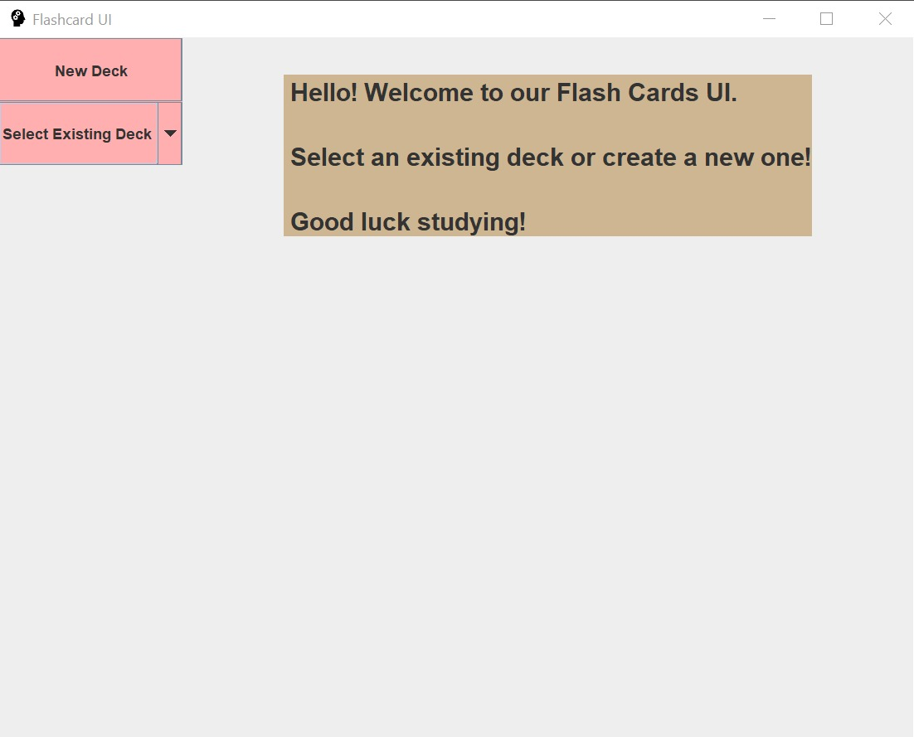
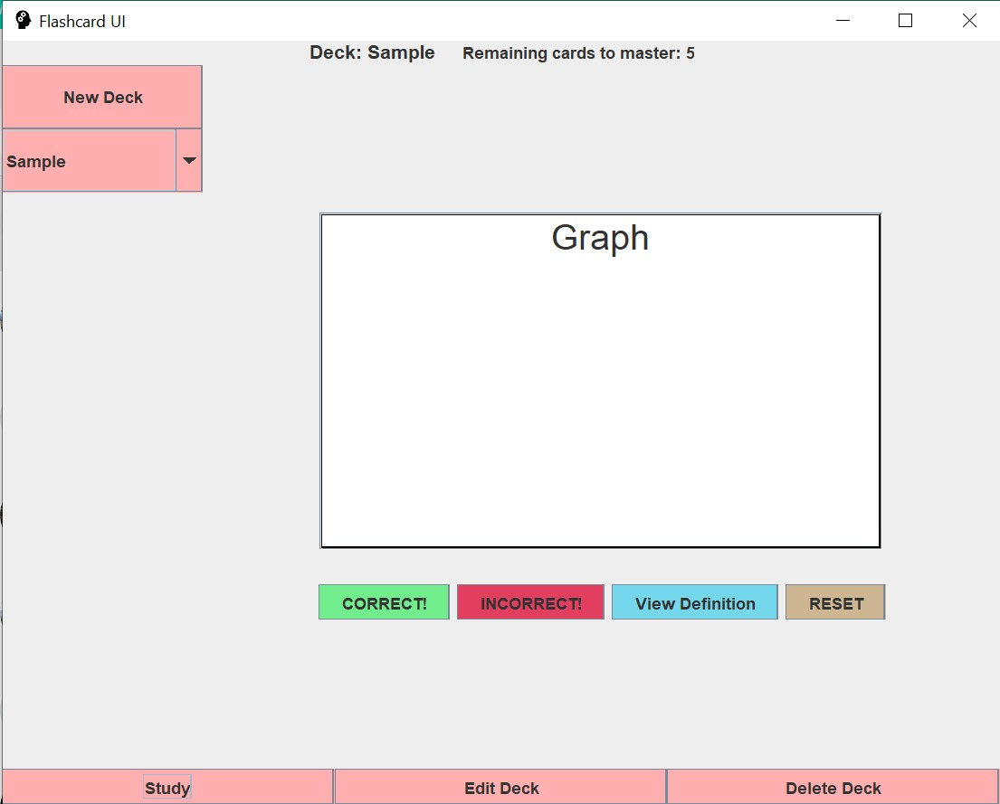
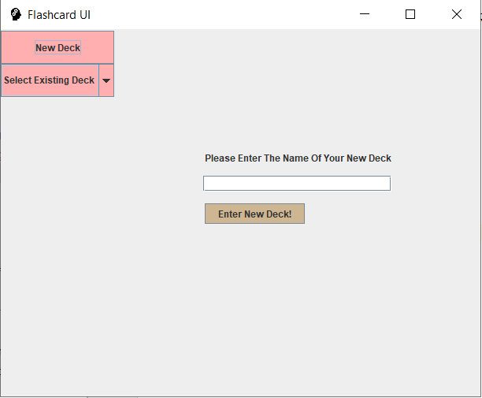
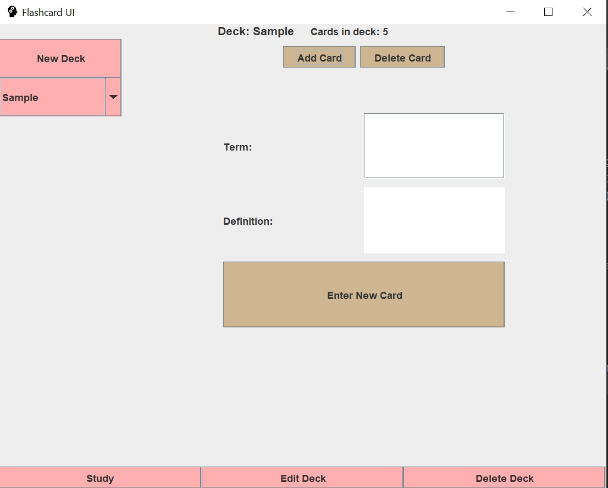
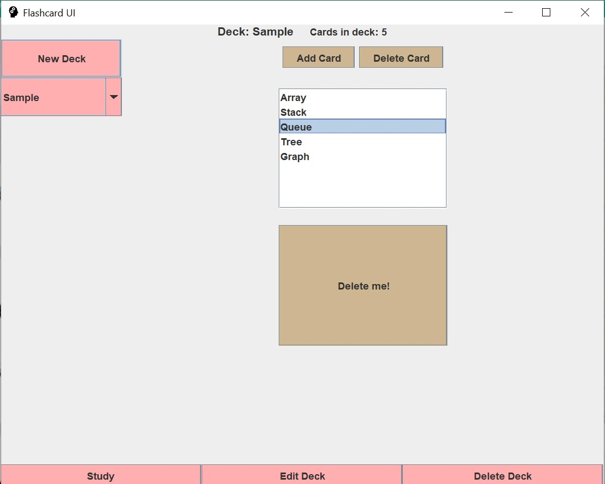
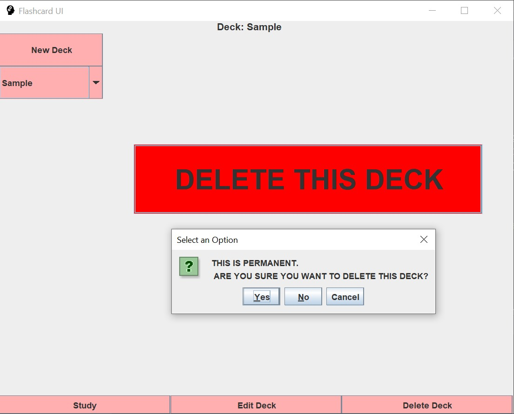

### FlashCards
This is a desktop study card application built in Java with SQLite.

Contributors:
* Jennifer Komendant (@jkomendant)
* Shira Alter(@shiraalter)
* Ricki Peikes (@rpeikes)

##### User Interface
1. Opening

1. Study Deck

1. Create New Deck

1. Edit Deck

##### Design Pattern

##### Database Schema
